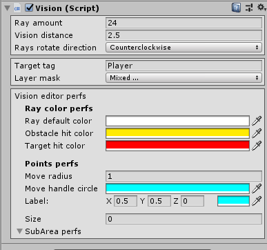
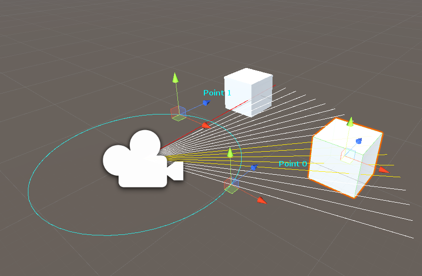

# LOS

This repository contain Line of sight asset

<table style="width: 100%;">
	<tbody>
		<tr>
			<td>  </td>
			<td>  </td>
			<td>  </td>
		</tr>
		<tr>
			<td> </td>
			<td>  </td>
			<td> </td>
		</tr>
	</tbody>
</table>

<b>Main features</b> 
<ul>
  <li>Configurable from Edit mode</li>
  <li>User friendly interface</li>	
  <li>Ability to detect obstacle colliders</li>
  <li>Ability to add subareas</li>
</ul> 

<dl>
  <dt>Unity version</dt>
  <dd>Package has been submitted using <b>Unity 2018.3</b></dd>
</dl>
